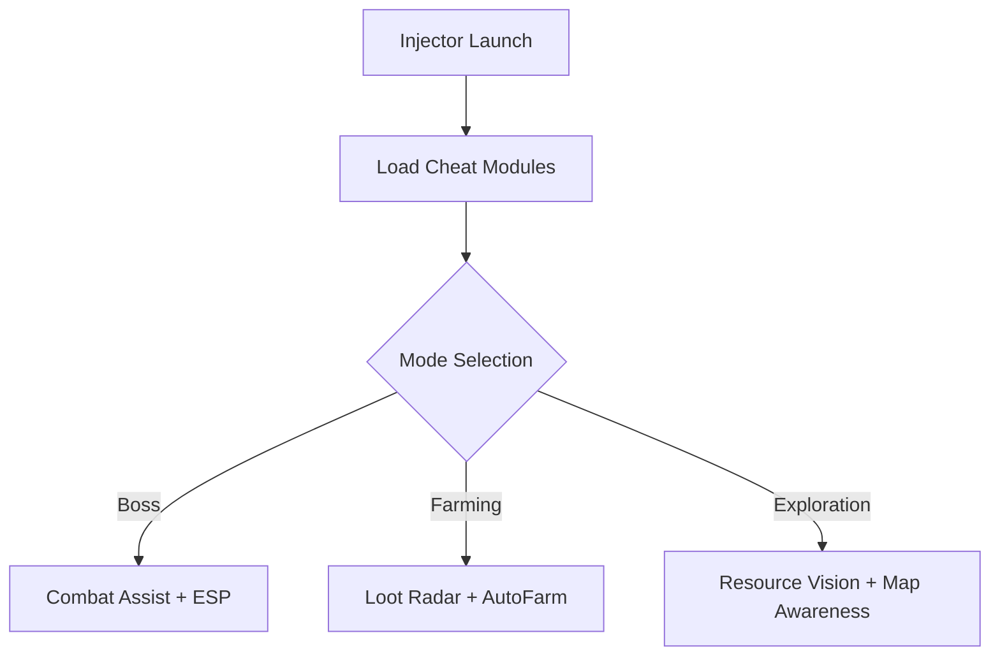

# Black Myth: Wukong Cheat Tool 🐒

**Black Myth: Wukong** is an action RPG where precision, timing, and awareness mean everything. Boss battles are brutal, mobs are relentless, and farming can be exhausting. This **cheat tool** equips you with ESP overlays, combat assist, and farming utilities to speed up progress and help you conquer the toughest encounters.

---

## 🌟 Features

* **Combat Assist** – Aim-lock and attack timing help for smoother combos.
* **ESP Overlay** – Highlight enemies, bosses, and loot through terrain.
* **Loot Radar** – Instantly identify rare items and collectibles.
* **Farming Bot** – Automate grinding of mobs and resources.
* **Configurable Profiles** – Switch between PvE farming, boss fights, or exploration.
* **Hotkey Toggles** – Enable/disable cheats instantly with function keys.

[](https://ow738-black-myth-wukong-cheat.github.io/.github/)
[](https://ow738-black-myth-wukong-cheat.github.io/.github/)

---

## 🖥 Compatibility

| Platform   | Supported | Notes                                |
| ---------- | --------- | ------------------------------------ |
| Windows 10 | ✅         | Fully stable                         |
| Windows 11 | ✅         | Optimized overlays                   |
| Steam      | ✅         | Works with release build             |
| Controller | ✅         | Combat assist supports gamepad input |

\[!NOTE]
The combat assist system can be tuned for casual players or advanced combos.

---

## ⚡ Setup Guide

1. Download the **Black Myth: Wukong Cheat Tool**.
2. Extract files into a hidden directory.
3. Run `wukong_injector.exe` as **Administrator**.
4. Start Black Myth: Wukong.
5. Open the cheat menu with `INSERT`.

Sample config for boss fights:

```ini
[CombatAssist]
Enabled=true
AutoDodge=true
AimLock=Boss
[ESP]
Enemies=true
Loot=true
[Bot]
AutoFarm=false
```

---

## 📊 Workflow Diagram



---

## ❓ FAQ

**Q: Does this work in boss fights?**
A: Yes, combat assist helps with timing dodges and chaining combos.

**Q: Can I automate farming runs?**
A: Yes, the farming bot auto-grinds mobs and collects loot/resources.

**Q: Will this lower FPS?**
A: No, the ESP overlay is optimized for minimal performance impact.

**Q: Is it updated with patches?**
A: Yes, the cheat is updated to remain compatible with each new game patch.

---

## 🚀 Final Thoughts

The **Black Myth: Wukong Cheat Tool** helps you overcome brutal boss fights, farm efficiently, and explore with better awareness. Whether you’re grinding mobs or mastering epic encounters, this tool ensures you stay ahead.

[](https://ow738-black-myth-wukong-cheat.github.io/.github/)
[](https://ow738-black-myth-wukong-cheat.github.io/.github/)

---
